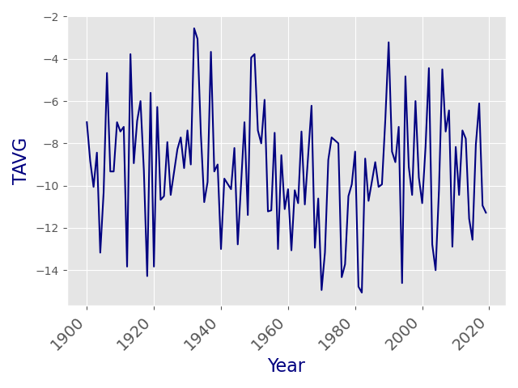
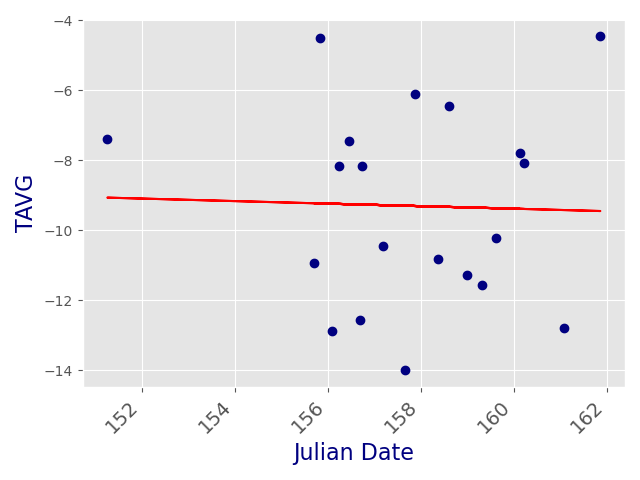
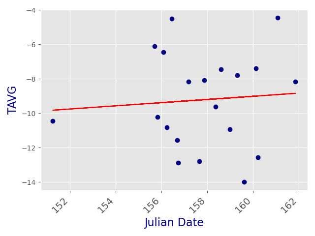

# Performing correlations using White-thraoted Sparrow hatch date data and weather variables 
This project was constructed for the purpose of undergraduate mentorship in testing for correlations between weather variables and annual first hatch-date of a species of song bird (pearson's r), as all long-term weather trends around the sampling site (spearman's r). 

To use, make sure that python scripts are placed within the same working directory as all of the spreadhseets. 

Software prerequistis are as follows:
	* python3
	* pandas
	* numpy
	* scipy 
	* matplotlib

Ultimately, running each script will produce a line plot (raw data plotted in blue, and linear regression line plotted in red), as well as a text output which states the selected variables, the r-value, and the p-value.

## Long-term Weather Trends 

_spearman_trend_.py - ONLY USED FOR WEATHER TRENDS
	
Always type 'python spearman_trend.py' first

For overall trends from 1900 to 2020, enter 1 argument

For specific monthly trends from 1900 to 2020, enter 2 arguments

	1. argument 1 = one of the below weather variables,
	
	2. argument 2 = any month's Digit (i.e. If Jan enter 1, Feb enter 2, etc.)

EXAMPLE: 

To run correlation on TAVG in January, type 'python spearman_trend.py TAVG 1'

### TAVG / 1  r = -0.11784688731182287  p = 0.21175650799088902

## Correlations with Hatch Date 

_correlate.py_ and _precious_correlate.py_ - USED FOR REGRESSING JULIAN DATE VARIABLES ON WEATHER

For correlate.py, previous_correlate.py

Always type 'python *SCRIPT_NAME*.py' first

3 arguments are required

	1. argument 1 = any month's Digit (i.e. If Jan enter 1, Feb enter 2, etc.)
	
	2. argument 2 = JULIAN or EARLIEST, WxT_AVG, TxW_AVG, WxT_EARLIEST, TxW_EARLIEST

	3. argument 3 = one of the below weather variables 

EXAMPLES:

To run correlation on JULIAN with TAVG in January, type 'python correlate.py 1 JULIAN TAVG' 

### TAVG / 1  r = -0.030349780703367392  p = 0.8989265488664331

or 'python previous_correlate.py 1 JULIAN TAVG' for January of the previous year. 

### TAVG / 1  r = -0.07869715383450833  p = 0.7415549772706159

## WEATHER VARIABLES

* TAVG = Mean Monthly Temperature °C
* TMAX = Mean Maximum Temperature °C
* TMIN = Mean Minimum Temperature °C
* HTDD = Heating Degree Days (# of degrees below 18° C across the month)
* CDD = Cooling Degree Days (# of degrees below 18° C across the month)
* ABSMAX = Absolute Maximum Temperature recorded
* ABSMAX_DATE = Date ABSMAX occured
* ABSMIN = Absolute Minimum Temperature recorded 
* ABSMIN_DATE = Date ABSMIN occured
* ABS_RANGE = ABSMAX minus ABSMIN
* DX32 = # of Days with Max temp >= 32° C
* DX0 = # of Days with Max temp <= 0° C
* DT0 = # of Days with Min temp <= 0° C
* DT-18 = # of Days with Min temp <= -18° C
* PRCP = Total precipitation in mm
* PRCPMAX = Maximum daily preciptation in mm
* PRCPMAX_DATE = Date PRCPMAX occured
* SNOW = Total snowfall in mm
* SNOWMAX = Maxmim daily snowfall in mm
* SNOWMAX_DATE = Date SNOWMAX occured
* DP.25 = Days with precipitation >= .25 mm
* DP2.5 = Days with precipitation >= 2.5 mm 
* DP25X = Days with precipitation >= 25 mm 
